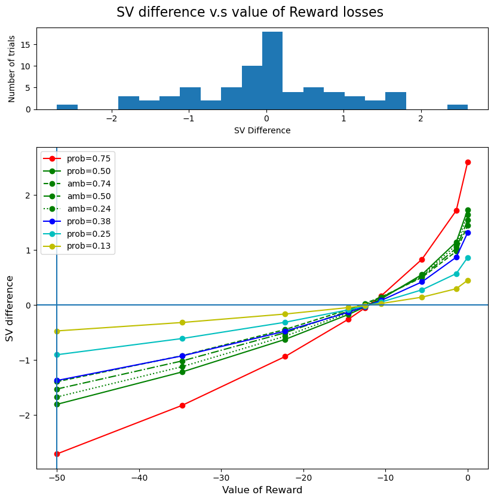

#  Adaptive CRDM
**Code by:**

Santiago Guardo & Ricardo Pizarro

**Supervision:**

Ricardo Pizarro and Silvia Lopez
## This script creates a new choice set given ADO o participant's input.

- It uses the parameters from the utility model and creates a new choice set that symmetrically samples the **subjective value difference**. 

 $SVlott = (p - \beta \cdot \frac{A}{2}) \cdot V^\alpha$   and   $SVsafe = V^\alpha$

- This will help increase CASANDRE model fit by having enogh and equal amount observations in each side of the point of subjective equality. 

- For each probability level:
    - We want to make 3 trials around the point of subjective equality.
    - We want 2 extreme trials.
        - Winning $50 for each probability level
        - Loosing $50 for each probability level
    - We want 4 intermediate trials.

This is how the trials are going to look like
 - For gains 
 
 - For losses

# How to use it
- If you are making a calibration visit and then a tailored choiceset visit
    - Run the utility model: https://github.com/CDN-Lab/IDM_model 
    - Modify the input of this cript so that it reads the parameters of the model
    - Run the script
- For ADO in person data, it's all going to be inbedded in psychopy. 

# Adaptive CDD

From the Subjective Value formula for the Delay Discounting:
# 
$$
SV_{\text{del}}= \frac{V_{\text{del}}}{1 + k\cdot d}
$$
        Where Vdel is the amount to be gained after a (d) delay, SV the subjective value and k the kappa parameter (discount 
        rate).

From this, we can calculate new values for a given SV. 
$$
V = SV \cdot (1+ K \cdot d)
$$

But, most importantly, we take advantage of the fact that, for this model, the only parameter that impacts SV is the delaye. So:
$$
V_{\text{now}} = SV_{\text{now}} 
$$

With this, we can play arround with $V_{\text{now}}$ and $V_{\text{del}}$ (and $SV_{\text{del}}$) to create different trials that symmetrically sample $\triangle SV$ to increase our confidence model fit. 

$$
\triangle SV = SV_{\text{del}} - SV_{\text{now}}

