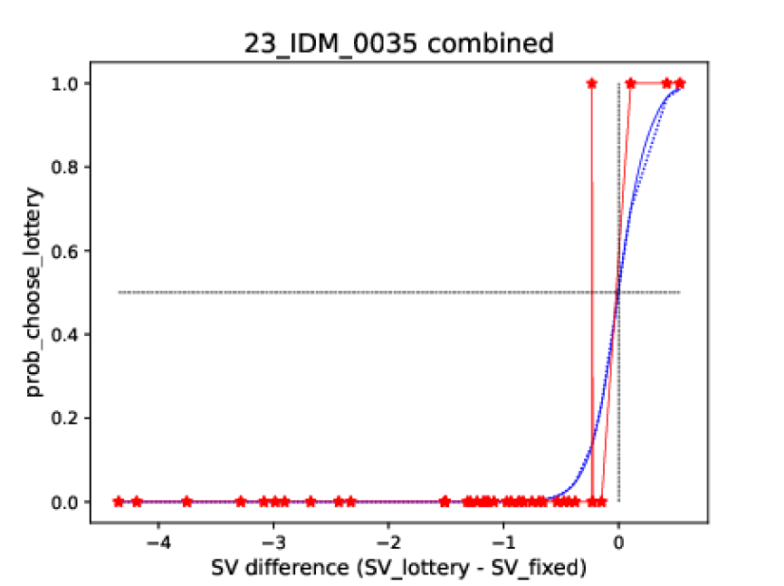
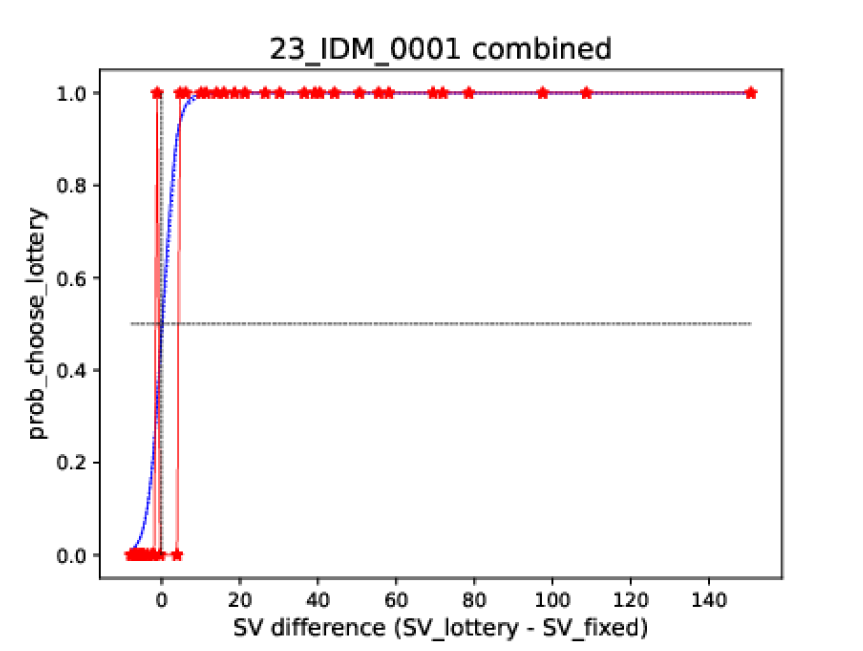
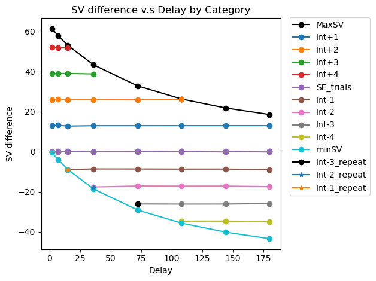

#  Adaptive Decision Making Tasks
**Code by:**

Santiago Guardo & Ricardo Pizarro

**Supervision:**

Ricardo Pizarro and Silvia Lopez
## 0. Introduction

The following jupyter notebooks create trials for Risky Decision Making and Delayed Discounting tasks. They attempt to solve the problem of interindividual variability in fitting Cognitive Models to multiple individuals. 

Given classical choicesets and individual differences in risk and ambiguity preferences, and delay discounting attitudes, models that predict response have an equal number of observations for the given conditions (see pictures below). This decreases model fits and it's a problem for fitting meta=cognition models that depend on condifence reports at both sides of the indifference point $\triangle SV = 0$

    
    

# Confidence and Risky Decision Making

From the utility model:
 

 $$SV_{\text{lott}} = (p - \beta \cdot \frac{A}{2}) \cdot V^\alpha$$  

 
 $$SV_{\text{safe}} = V^\alpha$$

We can solve for V and create different combinations of certain v.s uncertain values for several subjective values. 
$$V = \left(\frac{SV}{p-\frac{\beta A}{2}}\right)^\frac{1}{\alpha}$$

- For each probability level:
    - We want to make 3 trials around the point of subjective equality.
    - We want 2 extreme trials.
        - Winning $50 for each probability level
        - Loosing $50 for each probability level
    - We want 4 intermediate trials.

This is how the trials are going to look like
- For gains
    
    

- For losses
    
    

 

# Delay Discounting Task

From the Subjective Value formula for the Delay Discounting:
 
$$
SV_{\text{del}}= \frac{V_{\text{del}}}{1 + k\cdot d}
$$
        Where Vdel is the amount to be gained after a (d) delay, SV the subjective value and k the kappa parameter (discount 
        rate).

From this, we can calculate new values for a given SV. 

$$
V = SV \cdot (1+ K \cdot d)
$$

But, most importantly, we take advantage of the fact that, for this model, the only parameter that impacts SV is the delaye. So:
$V_{\text{now}} = SV_{\text{now}}$

With this, we can play arround with $V_{\text{now}}$ and $V_{\text{del}}$ (and $SV_{\text{del}}$) to create different trials that symmetrically sample $\triangle SV$ to increase our confidence model fit. 

$$
\triangle SV = SV_{\text{del}} - SV_{\text{now}}
$$

This is how the trials are going to look like: 
    

# How to use it
- If you are making a calibration visit and then a tailored choiceset visit
    - Run the utility model: https://github.com/CDN-Lab/IDM_model 
    - Modify the input of this script so that it reads the parameters of the model
    - Run the script
- For ADO in person data, it's all going to be inbedded in psychopy.